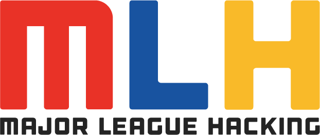
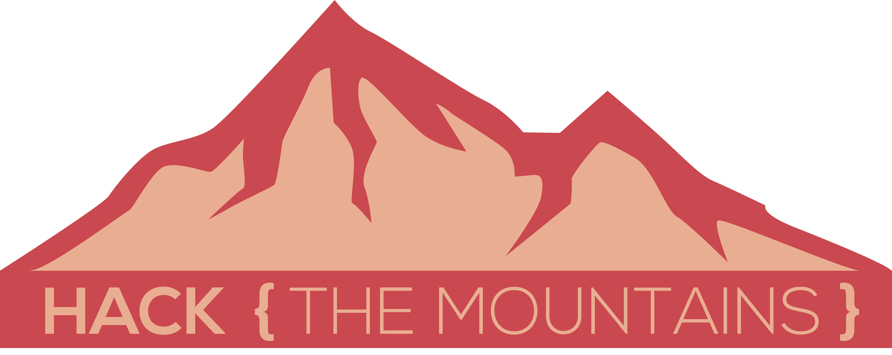

# DoubtHut- HTM'20
<p align="center">

</p>
<p align="center">
	<a href="http://doubthut.azurewebsites.net/"> CLICK HERE</a>
</p>






<hr>


<hr>

# TRACK : Education

Isn't the education system in our country too professor oriented and dependent? I mean can't an engineering student solve the science related asked by a student of a lower grade, or an a person pursuing bachelors in English help a junior? I mean india has rougly 2 million teachers and 600 million students below the age of 18,that gives us 300 students per teacher. Now teachers being human beings can't solve every doubt, every query that comes in the mind of these curious children , right? In comes doubthut. This web app is a portal where a student can ask questions and other students can answer his/her questions .Also the students can post articles and read other students' articles and bookmark answers  for future reference. Each student has their own dashboard that includes questions raised by them, questions answered by them, articles posted by them and bookmarks added by them. Using this web app student of our nation can help each other learn better and grow into a more successful version of themselves. Using this web app they can stay in their homes and connect and help each other in their academic doubts. <br>
This app is fully responsive and works on both big screens and mobile phones perfectly.

<hr>

## Instructions to run


```bash
# clone the repository to your local machine
git clone [URL]

# install dependencies
npm install

# serve with hot reload
npm start


```

# Technologies Used


 


Deployed on &nbsp; 


## 📌 Prerequisites

### 💻 System requirement :

1. Any system with basic configuration.
2. Operating System : Any (Windows / Linux / Mac).

### 💿 Software requirement :

1. Updated browser
2. Node.js installed (If not download it [here](https://nodejs.org/en/download/)).
3. Any text editor of your choice.


## 📜 License

`DoubtHut` is available under the [](http://badges.mit-license.org). See the LICENSE file for more info.

## 🤝 Contributing

Please read [`Contributing.md`](https://github.com/sakshi-choudhary/DoubtHut-HTM_20/blob/main/Contributing.md) for details on our code of conduct, and the process for submitting pull requests to us.


<hr> 
<p align="center">
	Made with :heart: by <a href="http://sakshichoudhary.me">Sakshi Choudhary</a>
</p>


